

    
    <h1>🎵 Jeni Player 🎶</h1>
    
Welcome to Jeni Player – your ultimate music companion on Android! Dive into a world of endless melodies, perfectly tailored to suit every mood and moment. 🎧✨

---

  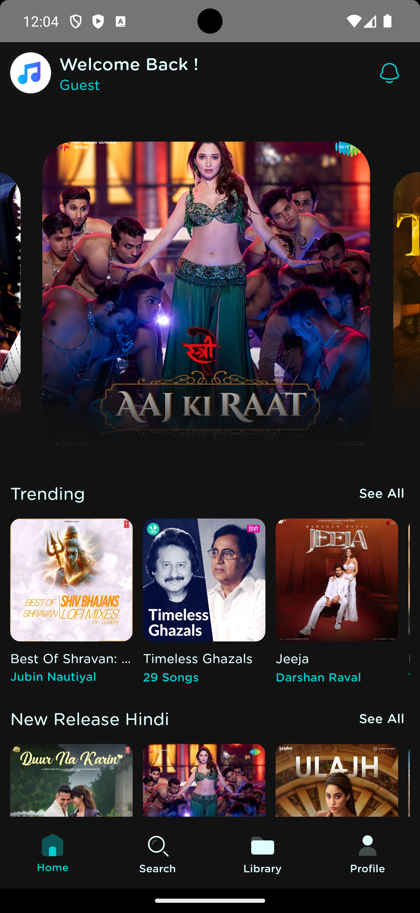
  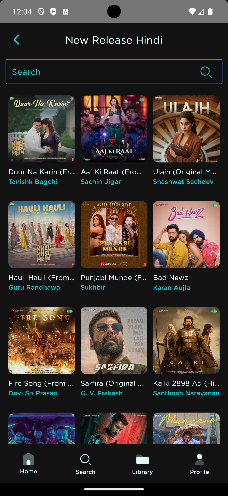
  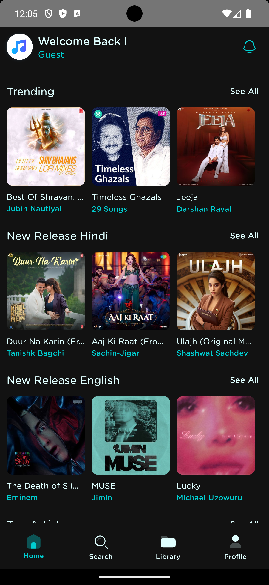

  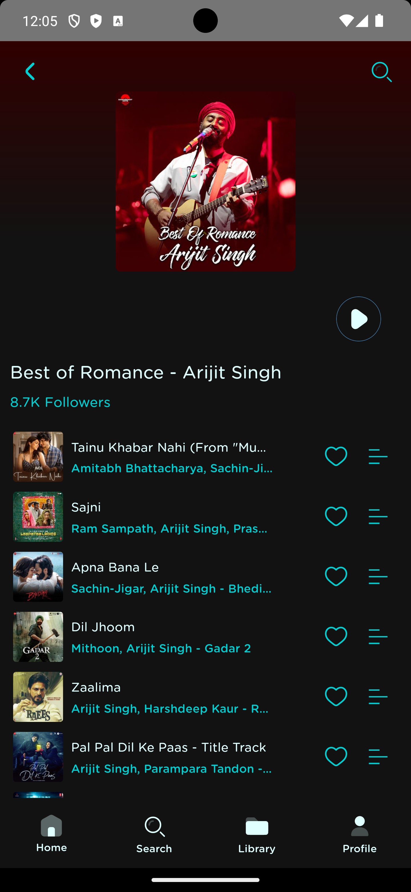
  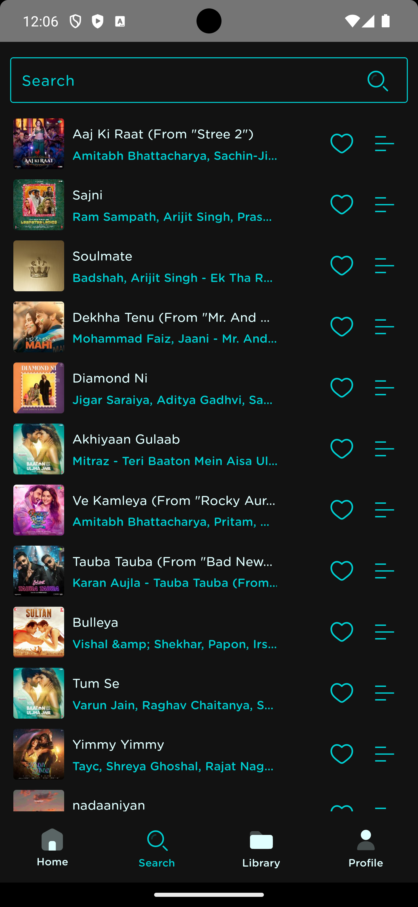
  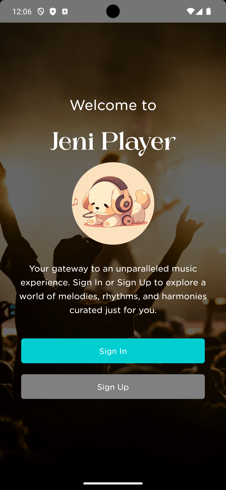

  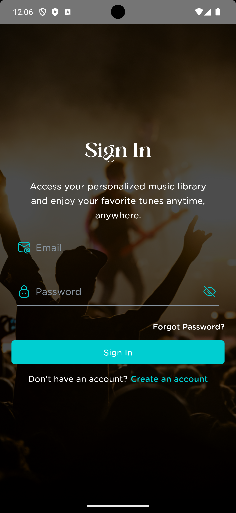
  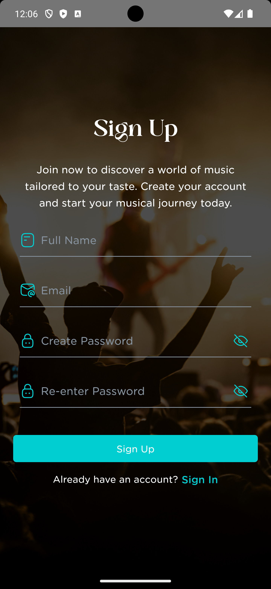
  

  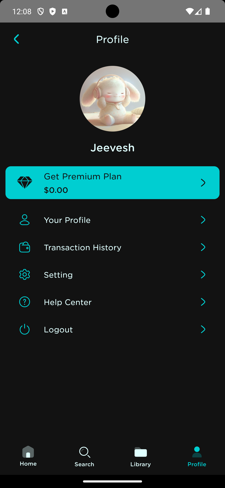
  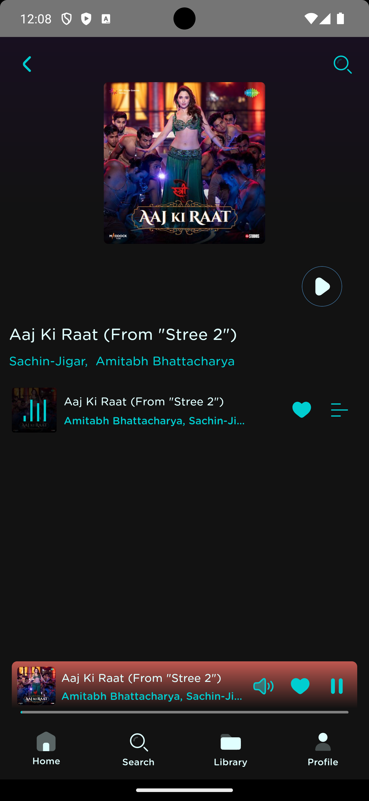
  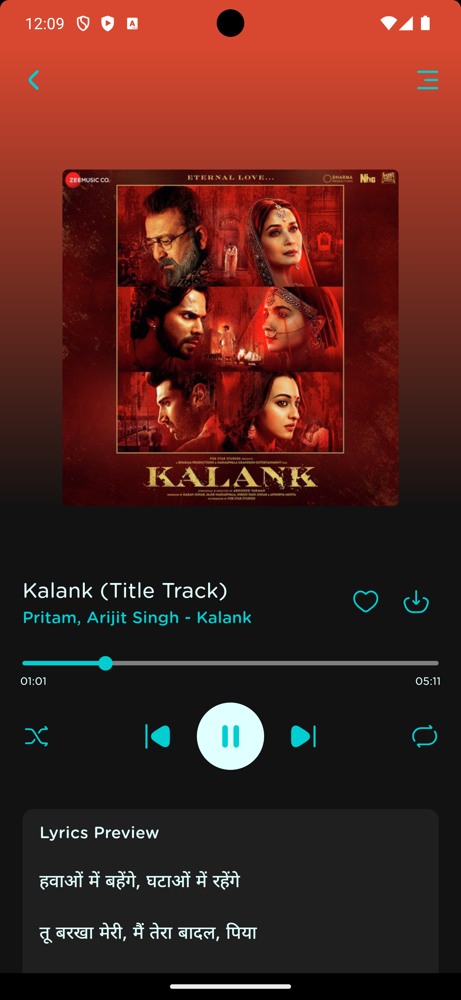
  

## 🎵 Jeni Player - Your Ultimate Music Experience 🎼
- 💸 Free Forever
- 🎵 Endless Songs
- 📥 Download Anytime
- 🌟 Favorite Your Tracks
- 📝 Lyrics Included
- ⏯️ Easy Playback Control
- 🔎 Find Any Song
- 🌈 Customizable Backgrounds
- 🎤 Curated Artist Playlists
- ✨ And So Much More!

## 📥 Download

## 📢 Disclaimer
This project and its contents are not affiliated with, funded, authorized, endorsed by, or in any way associated with Jio Saavn, Google LLC or any of its affiliates and subsidiaries.

Any trademark, service mark, trade name, or other intellectual property rights used in this project are owned by the respective owners.
